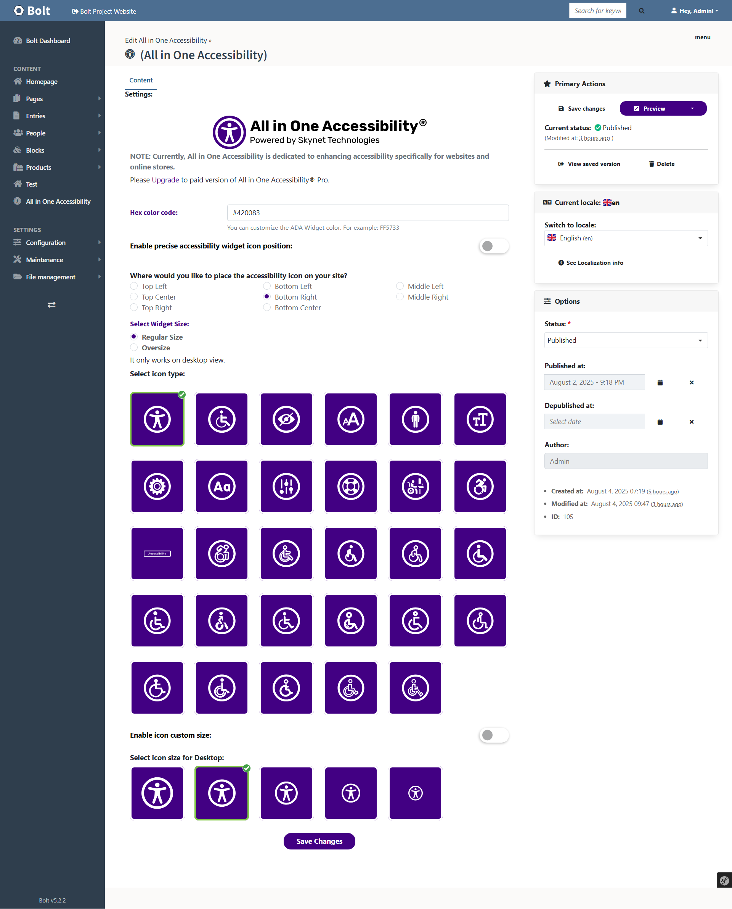

# All in One Accessibility: Bolt CMS Plugin

[All in One Accessibility](https://www.skynettechnologies.com/all-in-one-accessibility) widget improves Bolt website ADA compliance and browser experience for ADA, WCAG 2.1 & 2.2, Section 508, Australian DDA, European EAA EN 301 549, UK Equality Act (EA), Israeli Standard 5568, California Unruh, Ontario AODA, Canada ACA, German BITV, France RGAA, Brazilian Inclusion Law (LBI 13.146/2015), Spain UNE 139803:2012, JIS X 8341 (Japan), Italian Stanca Act and Switzerland DDA Standards.

It uses the accessibility interface which handles UI and design related adjustments. All in One Accessibility app enhances your Bolt website accessibility to people with hearing or vision impairments, motor impaired, color blind, dyslexia, cognitive & learning impairments, seizure and epileptic, and ADHD problems.

## Features
- 2 Minute installation
- AI widget Supports Over 65+ Different Languages
- Flexible and lightweight widget that can be changed according to law.
- Reduces the risk of time-consuming accessibility lawsuits.
- Screen Reader, widget color and accessibility profiles are the top features

#### Skip Links
- Skip to Menu
- Skip to Footer
- Skip to Navigation
- Open Accessibility Toolbar

#### Content Adjustments
- Content Scaling
- Readable Fonts
- Highlight Title
- Highlight Links
- Text Magnifier
- Adjust Font Sizing
- Adjust Line Height
- Adjust Letter Spacing
- Align Center
- Align Left
- Align Right

#### Color and Contrast Adjustments
- Dark Contrast
- Monochrome (Desaturate)
- Light Contrast
- High Saturation
- High Contrast
- Smart Contrast
- Low Saturation
- Invert Colors
- Adjust Background Colors
- Adjust Text Colors
- Adjust Title Colors

#### Orientation Adjustments
- Hide Images (Text Only)
- Miscellaneous
- Accessibility Statement
- Dynamic Application Color
- Choose Application Trigger Button Position
- Choose Application Position
- Multi Language

#### Supports 65+ languages
- English
- Spanish
- German
- Arabic
- Slovak
- Portuguese
- French
- Italian
- Polish
- Turkish
- Japanese
- Finnish
- Russian
- Hungarian
- Latin
- Greek
- Hebrew
- Bulgarian
- Catalan
- Chinese
- Czech
- Danish
- Dutch
- Hindi
- Indonesian
- Korean
- Lithuanian
- Malay
- Norwegian
- Romanian
- Slovenian
- Swedish
- Thai
- Ukrainian
- Vietnamese
- Bengali
- Sinhala
- Amharic
- Hmong
- Myanmar (Burmese)

## Installation


```bash
composer require skynetechnologies/bolt-allinoneaccessibility
```


## Setup

After that you will see a new `config/extensions/skynettechnologies-boltallinoneaccessibility.yaml` file.

Now you can create a new field with the fieldtype in `\config\bolt\contenttype.yaml` file.

```
All in One Accessibility:
    name: All in One Accessibility
    singular_name: All in One Accessibility
    fields:
        settings:
            type: allinoneaccessibility
    viewless: false
    taxonomy: [ ]
    locales: ['en', 'nl', 'pt_BR', 'es']
    singleton: true
    icon_many: "fa:home"
    icon_one: "fa:home"
```

Field can have autocompleteOptions key in order to set componentRestrictions for example

```
settings:
    type: allinoneaccessibility
    autocompleteOptions:
        componentRestrictions:
            country: 'us'
``` 

Now, run this command ```php bin/console extensions:configure``` in Cmd to configure the extension.

Backend Settings in Bolt CMS:



## Screenshots


## Video

[](https://www.youtube.com/watch?v=czwC0PKIqkc)

## Acknowledgements

 - [Bagisto All in One Accessibility](https://www.skynettechnologies.com/bagisto-accessibility-widget)
 - [Bagisto All in One Accessibility Extension installation steps blog](https://www.skynettechnologies.com/blog/bagisto-accessibility-menu-widget-installation)

## Documentation

[All in One Accessibility - User Guide](https://www.dropbox.com/s/de41n4xm9zjwxix/All-in-One-Accessibility-PRO-App-Usage-and-Functionality.pdf?dl=0)

## Support
For any kind of queries/support please Email us at [Skynet Technologies Support](mailto:hello@skynettechnologies.com)
